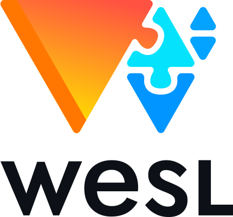

<!-- markdownlint-disable first-line-h1 -->

  <picture>
    <source media="(prefers-color-scheme: dark)" srcset="assets/logo/logo-square-dark.svg">
    
  </picture>

# WESL – A Community Standard for Enhanced WGSL

We propose building an enhanced version of WebGPU's
[WGSL](https://www.w3.org/TR/WGSL/) shading language
using community tooling.
We want to see WGSL enhancements shared more broadly.
We want to enable a WGSL library ecosystem.

Many community projects have independently uncovered
a need for WGSL enhancements like module composition,
conditional compilation, and shader libraries.
Fancier features like generics are also of interest in the community.
By evolving a shared community set of WGSL enhancement definitions,
we can build common tools.

Better tooling benefits everyone,
including smaller projects that can't afford to build
their own enhancements and associated tools.
And a shared standard can enable resusable WGSL libraries
on npm and crates.io.

Join us on [GitHub](https://github.com/wgsl-tooling-wg/wesl-spec)
or [Discord](https://discord.gg/Ng5FWmHuSv) to help.

## Goals

Our ambition is to create a modestly improved, practical variant of WGSL
called WESL (**W**GSL **E**nhanced **S**hading **L**anguage, pronounced like 'weasel'). <!-- spellchecker:disable-line -->

WESL should feel like WGSL with a few useful things added.

## WGSL Enhancements

We're aiming to prioritize WGSL enhancements that are: 1) important for community projects,
2) feel natural to the WGSL programmer,
and 3) not too difficult to integrate into community tools.

The simple enhancements we want to find will take some time to stabilize.
Adventurous projects will be able to opt in to experimental enhancements
to try alongside stable features.

Our first two WESL enhancements are:

* `import` statements
to enable a module system so users can organize their shaders across multiple file.
See spec draft here: **[imports]**.
* conditional translation via `@if` statements
so shaders can be customized based on external flags.
See spec draft here: **[Conditional Translation]**.

## Stability

As a community project,
we can iterate quickly on experimental WGSL features.

Stabilized features will be grouped in periodic releases
with backwards compatibility with the aim of
nurturing an ecosystem of WESL/WGSL libraries.

## Filename extension

Source files containing
WESL files
should have the `.wesl` extension
to distinguish them from vanilla W3C WGSL.

## Enhancements Roadmap

WESL prioritized these features for its first release:

* [Imports] for splitting shaders into modules
* [Conditional Translation] for customizing shaders based on flags
* [Packaging] for publishing shaders on npm/cargo.

What would you like to see next?

## Relationship to W3C WGSL and WebGPU

WESL enhancements features are invisible to WebGPU engines
like Dawn and wgpu.
All WESL enhancements are translated to vanilla WGSL
before being passed to WebGPU calls
such as [`createShaderModule()`](https://developer.mozilla.org/en-US/docs/Web/API/GPUDevice/createShaderModule).

Hopefully community WESL enhancements will
help inform future versions of W3C standard WGSL.
But designing changes to W3C standard WGSL is
beyond the scope of this project.

## License

Except where noted (below and/or in individual files), all code in this repository is dual-licensed under either:

* MIT License ([LICENSE-MIT](LICENSE-MIT) or [http://opensource.org/licenses/MIT](http://opensource.org/licenses/MIT))
* Apache License, Version 2.0 ([LICENSE-APACHE](LICENSE-APACHE) or [http://www.apache.org/licenses/LICENSE-2.0](http://www.apache.org/licenses/LICENSE-2.0))

at your option.

### Your contributions

Unless you explicitly state otherwise,
any contribution intentionally submitted for inclusion in the work by you,
as defined in the Apache-2.0 license,
shall be dual licensed as above,
without any additional terms or conditions.

[imports]: Imports
[Conditional Translation]: ConditionalTranslation
[Packaging]: https://wesl-lang.dev/docs/Publishing-Packages
