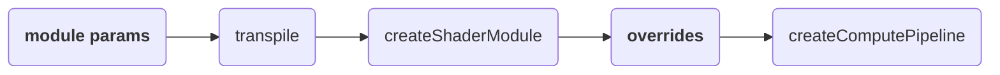

# Module Parameters: Design Notes

Companion to [ModuleParameters.md](222-ModuleParameters.md).

## Comparison with WGSL override

Override can't control what goes into a GPUShaderModule via `@if` (nor any future WESL mechanisms). Also overrides are not resettable by other shader code, which makes libraries hard to use from shader code.

| feature      | where allowed          | GPUShaderModule | @if | array sizes | set by importing | set in host code |
| ------------ | ---------------------- | --------------- | --- | ----------- | ---------------- | ---------------- |
| module param | inside `module<>`      | before          | yes | yes         | yes              | no               |
| module param | inside main `module<>` | before          | yes | yes         | no               | yes              |
| override     | anywhere               | after           | no  | workgroup arrays only | no               | yes (at pipeline creation) |
### Data flow


## Instantiation Sharing
What should be shared semantically between concrete instantiations of the same module? 

*TL;DR: types are shared unless they actually differ and var state is unique per concrete module parameterization.*

### Types across concrete modules with different module params 

First, looking at types:

```wgsl
/// bar.wesl
module <const DEBUG = false>;

struct Bar {
  b: u32,          // Bar never mentions DEBUG
}

@if(DEBUG)
fn check(b: Bar) { /* does some checking */ }
@else
fn check(b: Bar) { }
```

```wgsl
/// a.wesl
import package::bar::Bar; // imports bar.wesl (DEBUG false)

fn aFn(b: Bar) { ... }
```

```wgsl
/// b.wesl
import package::bar<DEBUG = true>::{Bar, check};
import super::a::aFn;

fn m() {
  let b = Bar(1);
  aFn(b);      // works: a's Bar and b's Bar are the same type
  check(b);
}
```

This example shows that for types, we want to share across module concretizations (to use @k2d222's term). 
WGSL types are nominal, and so we want types to be sharable when possible, otherwise
we'll see problems like `aFn` where types are oddly incompatible. 
To see if a type is shared, we look at the module parameters that it depends on (transitively),
same parameters = same type across the concrete modules.
`Bar` never uses `DEBUG`, so there's one `Bar` type no matter how many parameterizations of `bar.wesl` are in the link, and `aFn(b)` type checks. 

Some types can't be shared. The module parameter might dictate that we get a new type.
A struct that does use a module parameter forks per parameterization. That's required of course,
its layout is different: `struct Lights { l: array<u32, NUM_LIGHTS> }` must be a new type for
every value of NUM_LIGHTS.


### Vars across concrete modules 
Okay, enough types, how 'bout variables?
If there's a `var` in a parameterized WESL module, how many `var`s do we emit to WGSL?

#### Different module params 

```wgsl
/// rng.wesl
module <const SEED = 1>;

var<private> state: u32;    // declaration never mentions SEED...

fn init() { state = hash(SEED); }    // ...but the contents sure depend on it
fn next() -> u32 { state = lcg(state); return state; }
```

```wgsl
import package::rng<SEED = 1> as r1;
import package::rng<SEED = 2> as r2;    // two independent streams
```

Each concrete module with different parameterization should emit a different `var`. 

This example suggests too that we want to fork all of the module state, not try to trace parameters to individual declarations. `state`'s declaration never mentions `SEED`. 
The dependency is in `init()`'s body. So tracing would have to follow writes through function bodies, and maybe know which functions each importer actually calls. 
And even if tracing worked perfectly, it would be fragile: add one write somewhere and a var silently forks for every user.

#### Matching module params 

The previous example showed two import statements with different module parameters.
But what if two import statements have the same module parameters? 
Do we fork for every unique set of module parameters? Or fork at every import regardless?

```wgsl
/// lights.wesl - per-instantiation light list
module <const MAX = 8>;

struct Light { pos: vec3f, color: vec3f }

var<private> list: array<Light, MAX>;
var<private> count: u32;

fn push(l: Light) { list[count] = l; count += 1; }
fn get(i: u32) -> Light { return list[i]; }
```

```wgsl
/// cull.wesl - one library: fills the light list
import package::lights as l;
fn cullLights(...) { ... l::push(light); ... }

/// pbr.wesl - another library: reads the light list
import package::lights as l;
fn shade(...) -> vec3f { ... let light = l::get(i); ... }
```

I think this example shows we should emit a new set of `var`s for each unique module parameterization,
not new vars for every import statement. 
I imagine we'd const-eval and allow defaults for the parameters, so `import package::lights`, `import package::lights<MAX = 8>`, and `import package::lights<MAX = 4 + 4>` are equivalent.
So there's one list of lights, and `cull` fills the same list that `pbr` reads. 
Modules with defaulted parameters are handled consistently with modules with no parameters.

### Authors can share more or less if they want

With those rules for when to share vars, there's still room for author control:

- State is unique per module parameterization, but if an author wants to share state across concrete modules,
  they can do so by hoisting the var into another module w/o the module parameter.
- State is shared per module-parameterization set, but if an author wants unique state per importer, 
  they have two options: pass in the state via a pointer; or add an additional module parameter
  `rng<STREAM = 47>` vs `rng<STREAM = 19>`.

## Module parameters designs in other languages

Sanity checking vs other languages..
- _types unique by used parameters_: 
  the sketch is pretty close to Zig, where struct identity keys on the parameters captured by the comptime declaration. 
  The sketch is finer grained than C++ or D templates (or Slang generics), which fork types on unused parameters too. 
  But a template wraps one struct where a module header covers a whole file. 
  OCaml applicative functors are similar in this respect: types produced
  by a functor are the same when the functor arguments are the same. 
  Anyway, I don't see much upside in emitting more distinct types than strictly necessary. 
- _vars unique per parameter set_: same as C++/D template statics (one static per concretization, program-wide), or Slang. 
  Zig is finer grained due to their comptime approach, the SEED would be accidentally shared unless you write it differently. (Or maybe our parameterized modules are each one comptime block..)
  Generic statics have been [requested for Rust](https://smallcultfollowing.com/babysteps/blog/2022/04/17/coherence-and-crate-level-where-clauses/#module-level-generics),
  but it's hard with separate compilation and dyn.
- _set params from host code_: Slang module configuration uses a separate `extern`/`export` syntax, host code reflects and picks.
  This WESL sketch uses a unified syntax, settable from imports or from the host.


## Why module params if we'll someday have params on other things?

Module params specialize a module in the same way 
that generic function parameters will specialize a function. 
The mental model is one mechanism at different sizes: 
the stuff inside the `< >` will eventually apply to
modules (large), contracts/interfaces (medium), 
functions and structs (small).

Only a module level mechanism can wrap module-level statements
like `var` declarations, `import`s, and `@if` over entire declarations.
Module level is where state is held in WGSL.
That's where the `var`s are, and we want to let users parameterize `var`
types and also `@if` conditionally declare `var`s.

Our favorite generic schemes for abstract bundles of functions are deliberately stateless. (e.g. Rust traits have functions, not state.)
GPU programming naturally separates data from functions. 
WESL likely will keep that separation rather than leaning object-oriented. 
But users still want generic functionality over vars: in the rng example, each `import rng<SEED = n>` gets its own generator state. 
Module params allow for parameterized state while functions and contracts stay stateless.

Also, it's likely that generic function parameters will not be used to drive `@if` decisions inside the function; 
entangling those would complicate typechecking and condition processing.
A module parameter is the natural place to put a parameter
that drives conditions inside the function body.

```wgsl
module <const MOBILE = false>;

fn foo() {
  @if(!MOBILE) doExpensive();
}
```
